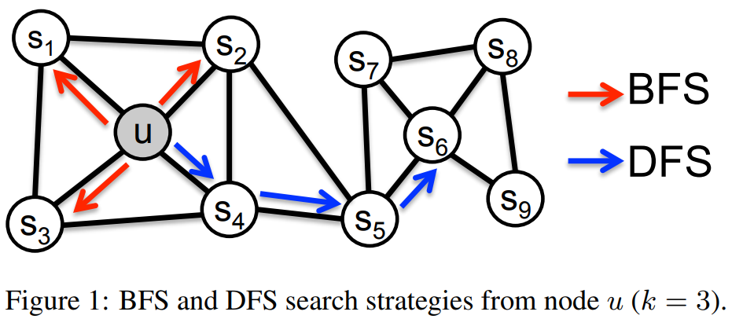

# node2vec group project 

This project is a part of the [Data Mining course](https://www.uu.se/en/admissions/master/selma/kursplan/?kKod=1DL370&lasar=) at Uppsala University, Sweden. 
Team members are [Dmitrijs Kass](https://github.com/dmitrijsk), 
[Hardy Hasan](https://github.com/HardyHasan94) 
and [Yasser Kaddoura](https://github.com/YasserKa).

The goal of the project is two-fold: 
* reproduce the experimental results in **node2vec: Scalable Feature Learning for Networks** [1],
* perform additional experiments with network graphs not used in the above-mentioned paper. 

[1] Grover, A., & Leskovec, J. (2016, August). node2vec: Scalable feature learning for networks. In *Proceedings of the 22nd ACM SIGKDD international conference on Knowledge discovery and data mining* (pp. 855-864). [https://doi.org/10.1145/2939672.2939754](https://doi.org/10.1145/2939672.2939754) 

## What is node2vec?

node2vec is an algorithmic framework for representational learning on graphs. 
Given any graph, it can learn continuous feature representations for the nodes, 
which can then be used for various downstream machine learning tasks. Examples are 

* Clustering of nodes with emphasis on either *homophily* or *structural equivalence*. Implementation [here below](#clustering) by [Dmitrijs Kass](https://github.com/dmitrijsk).
* Classification. Implementation [here below](#classification) by [Yasser Kaddoura](https://github.com/YasserKa).
* Link prediction. Imlpementation [here below](#link-prediction) by [Hardy Hasan](https://github.com/HardyHasan94).


## Dependencies

This repo is a fork from [the official reference implementation](https://github.com/aditya-grover/node2vec) of [1].
Clone the current repo and create the `conda` virtual environment:

```
git clone https://github.com/dmitrijsk/node2vec.git
conda create -n node2vec-env python=3.8
conda activate node2vec-env
python -m pip install -r node2vec/requirements.txt
```


## Clustering

    * Under the *homophily* hypothesis nodes that are highly interconnected and belong to similar network clusters or communities should be embedded closely together 
      (e.g., nodes *s1* and *u* in Figure 1 belong to the same network community)
    * Under the *structural equivalence assumption* nodes that have similar structural roles in networks should be embedded closely together.
      (e.g., nodes *u* and *s6* in Figure 1 act as hubs of their corresponding communities).

 


Code is available in `src/kmeans.py`. To run the code from the command line use:

`python src/kmeans.py`

The initial purpose was to reproduce Figure 3 in node2vec paper. Therefore, the default type of analysis is homophily clustering of Les Misérables characters. To use the code for other purposes, please read below about changing parameter values.

Three types of analyses are supported: 

1. Homophily (community structure) with node2vec embeddings.
2. Structural equivalance with node2vec embeddings.
3. Structural equivalance with struc2vec embeddings. struc2vec embeddings for Les Misérables and [TerroristRel](https://networkrepository.com/TerroristRel.php) data sets are already available. To obtain embeddings for other data sets in Python 3 consider using, for example, [BioNEV](https://github.com/xiangyue9607/BioNEV).

Change the value of the `SWITCH` variable to define the type of analysis. Available options are `homophily`, `str_eq`, `struc2vec`.

Two types of graph data sets are supported:

1. An arbitrary data set in an external edgelist text file.
2. Les Misérables from `nx.generators.social.les_miserables_graph()` because it contains the names of characters in the novel instead of integer identifiers.

Change the value of the `DATA_NAME` variable to define a data set to be used. The value should be the same as in the folder name and the edgelist file name. For example, use `TerroristRel` to import from `graph/TerroristRel/TerroristRel.edges`.

Additional parameters are set in the `args` variable:

* node2vec's parameters `D` (dimensionality of embeddings), `P` (return parameter), `K` (context size) and `L` (walk length).
* `edgelist_delim`, default is comma.

A few other parameters depend on the type of analysis and are set automatically. For example, homophily by default sets the in-out parameter `Q` to 0.5 and the number of clusters `n_clusters` to 6. This can be changed in the `set_other_parameters()` function if needed.

The code outputs images into the `images/` folder.


## Classification
Code is available in `src/classification.ipynb` (Jupyter Notebook)
Sections of the notebook: 
- Replicate the classification experiment in section **4.3 Multi-label classification** 
- Grid search on `p` and `q`
- Scalability test (not used in presentataion)
## Link Prediction
- The files src/dataProcessing.py, src/main.py and src/linkPrediction.py are used for link prediction.
- Given an original edgelist, link prediction is performed as follows, where the data used is karate.edgelist:
1. To obtain training graph and testing edges, execute the following command from the project home directory:
```python3 src/dataProcessing.py --input_path graph/karate/karate.edgelist --output_train_path graph/karate/train_edges --output_test_path graph/karate/test_edges --testing_data_ratio 0.2```
2. To obtain node embeddings, execute the following command from the project home directory: 
```python3 src/main.py --input graph/karate/train_edges --output emb/karate.emb     ```
3.  To obtain predictions, execute the following command from the project home directory
```python3 src/linkPrediction.py --original_edges_path graph/karate/karate.edgelist --node_embeddings_path emb/karate.emb --training_edges_path graph/karate/train_edges --test_edges_path graph/karate/test_edges```
