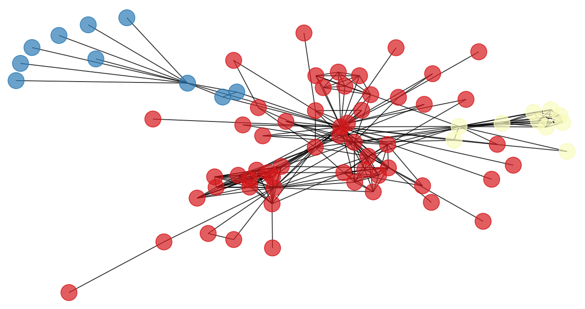
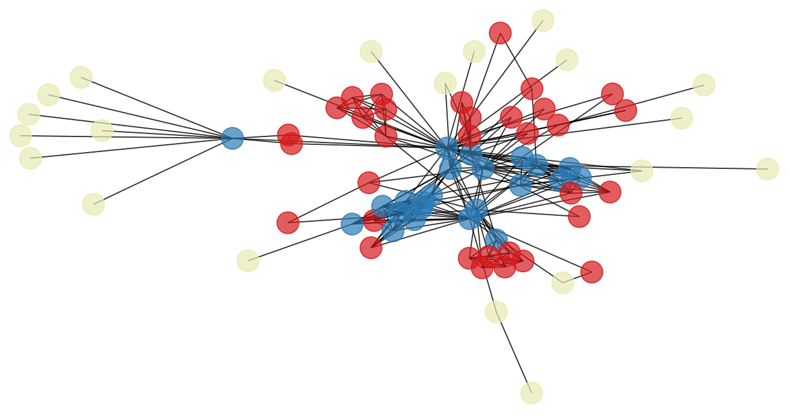

# node2vec group project 

This project is a part of the [Data Mining course](https://www.uu.se/en/admissions/master/selma/kursplan/?kKod=1DL370&lasar=) at Uppsala University, Sweden. 
Team members are [Dmitrijs Kass](https://github.com/dmitrijsk), 
[Hardy Hasan](https://github.com/HardyHasan94) 
and [Yasser Kaddoura](https://github.com/YasserKa).

The goal of the project is two-fold: 
* reproduce the experimental results in **node2vec: Scalable Feature Learning for Networks** [1] with Python,
* perform additional experiments with network graphs not used in the above-mentioned paper. 

[1] Grover, A., & Leskovec, J. (2016, August). node2vec: Scalable feature learning for networks. In *Proceedings of the 22nd ACM SIGKDD international conference on Knowledge discovery and data mining* (pp. 855-864). [https://doi.org/10.1145/2939672.2939754](https://doi.org/10.1145/2939672.2939754) 

## What is node2vec?

<p align="center">
  
</p>

The figure above from [3] summarizes the goal of graph representation learning achieved by node2vec.
node2vec is an algorithmic framework for representational learning on graphs. 
Given any graph, it can learn continuous feature representations for the nodes, 
which can then be used for various downstream machine learning tasks [2]. 
No manual feature engineering is required. 

We implemented the following downstream machine learning tasks with node2vec in this repo: 

| Task | Student | 
| -------- | -------- | 
| Clustering ([see below](#clustering-dmitrijs))            | [Dmitrijs Kass](https://github.com/dmitrijsk)   |
| Classification ([see below](#classification-yasser))    | [Yasser Kaddoura](https://github.com/YasserKa)  |
| Link prediction ([see below](#link-prediction-hardy))  | [Hardy Hasan](https://github.com/HardyHasan94)  |

[2] node2vec project page: [https://snap.stanford.edu/node2vec](https://snap.stanford.edu/node2vec). \
[3] Stanford CS224W: Machine Learning with Graphs. Lecture "Node embeddings" slides. Available [here](http://web.stanford.edu/class/cs224w/slides/03-nodeemb.pdf).

## Dependencies

This repo is a fork from [the official reference implementation](https://github.com/aditya-grover/node2vec) of [1].
Clone the current repo, create the `conda` virtual environment and install the requirements:

```
git clone https://github.com/dmitrijsk/node2vec.git
conda create -n node2vec-env python=3.8
conda activate node2vec-env
python -m pip install -r node2vec/requirements.txt
```

## Clustering (Dmitrijs)

### Introduction

We are sometimes interested in identifying homogeneous groups of nodes in a network. 
However, homogeneity can be defined in various ways. 
According to [1], node2vec can compute embeddings of nodes with emphasis on either **homophily** or **structural equivalence**. 
This is illustrated in a figure below from [1]:

<p align="center">
  
</p>

Under the **homophily** hypothesis nodes that are highly interconnected and belong to similar network clusters or communities should be embedded closely together.
E.g., nodes *s1* and *u* in Figure 1 belong to the same network community

Under the **structural equivalence** assumption, nodes with similar structural roles in networks should be closely embedded.
E.g., nodes *u* and *s6* in Figure 1 act as hubs of their corresponding communities.


### Reproduction of Figure 3 in [1]

Below is a reproduction of **homogeneity** clustering of characters in the novel Les Misérabthe, which is at the top of Figure 3 in [1]. 
The reproduced figure uses node2vec for node embeddings with the return parameter *p=1* and in-out parameter *q=0.5* 
and *k*-means for clustering with *k=6* clusters.

| Homogeneity: Top of Figure 3 in [1] | Our reproduction with node2vec | 
| -------- | -------- | 
|  |   |

It is not exactly 1-to-1 but is sufficiently close.

Clustering under the **structural equivalence** hypothesis could not be reproduced with the recommended *p=1*, *q=2*, and 3 clusters hyper-parameters. 
It turns out that this is a known issue: 

* According to [4], no result could capture the structural equivalence even with grid-search over hyper-parameters. 
The graph kept representing the community structure.
* According to [5], node2vec should not even be capable of capturing the notion of structural equivalence. 
The reason is that two nodes that are "far" in the network will tend to be separated in the latent representation, 
independent of their local structure. 

The following summarizes our experiments w.r.t. the **structural equivalence**: 

* Left: the original figure from [1] reflects structural equivalence.
* Middle: our reproduction with node2vec embeddings with the recommended hyper-parameters that fail to capture the structural equivalence.
* Right: our reproduction with struc2vec embeddings that does not fully reproduce the original figure, but it does reflect the structural equivalence.
Yellow nodes mostly represent the novel's characters that are at the periphery and have limited interaction. 
And blue-colored nodes represent characters that act as bridges between different sub-plots of the novel.


| Structural equivalence: Bottom of Figure 3 in [1] | Our reproduction with node2vec | Our reproduction with struc2vec | 
| -------- | -------- | -------- |  
|  |   |  |


[4] Schliski, F., Schlötterer, J., & Granitzer, M. (2020). Influence of Random Walk Parametrization on Graph Embeddings. 
Advances in Information Retrieval, 12036, 58. \
[5] Ribeiro, L. F., Saverese, P. H., & Figueiredo, D. R. (2017, August). struc2vec: Learning node representations from structural identity. 
In Proceedings of the 23rd ACM SIGKDD international conference on knowledge discovery and data mining (pp. 385-394). 
Official implementation on GitHub available [here](https://github.com/leoribeiro/struc2vec).


### Clustering of the TerroristRel network

We use a TerroristRel network [6], the network of terrorists and their relationships, as an additional network example not used in [1].
Below is a clustering of the TerroristRel network with *p=1*, *q=0.5*, and 10 clusters reflecting homophily.
Therefore, these clusters highlight highly interconnected terrorists that belong to similar communities.

<p align="center">
  
</p>

[6] https://networkrepository.com/TerroristRel.php


### Python implementation

To run a demo, use:

`python src/kmeans.py --demo les_miserables_homophily --plot_labels`

Other options for demo are `les_miserables_str_eq_node2vec` 
and `les_miserables_str_eq_struc2vec`.

The code outputs embeddings into `./emb` and images into `./images`. 
To run for your own network graph, 
use `python src/kmeans.py` with the following arguments:

`--path_to_edgelist` - path to the *.edgelist file that represents the network. \
`--edgelist_sep` - separator used in the edgelist file. Default: ` ` (space) \
`--plot_labels` - to plot node labels \
`--p` - return parameter. Default: 1 \
`--q` - in-out parameter. Default: 0.5\
`--d` - dimensionality of embeddings. Default: 16\
`--k` - window (context) size. Default: 10\
`--l` - walk length. Default: 80\
`--n_clusters` - number of k-means clusters.


## Classification (Yasser)

Code is available in `src/classification.ipynb` (Jupyter Notebook)
Sections of the notebook: 
- Replicate the classification experiment in section **4.3 Multi-label classification** 
- Grid search on `p` and `q`
- Scalability test (not used in presentation)

## Link Prediction (Hardy)

- The files src/dataProcessing.py, src/main.py, and src/linkPrediction.py are used for link prediction.
- Given an original edgelist, link prediction is performed as follows, where the data used is karate. edgelist:
1. To obtain a training graph and testing edges, execute the following command from the project home directory:
```python3 src/dataProcessing.py --input_path graph/karate/karate.edgelist --output_train_path graph/karate/train_edges --output_test_path graph/karate/test_edges --testing_data_ratio 0.2```
2. To obtain node embeddings, execute the following command from the project home directory: 
```python3 src/main.py --input graph/karate/train_edges --output emb/karate.emb     ```
3.  To obtain predictions, execute the following command from the project home directory
```python3 src/linkPrediction.py --original_edges_path graph/karate/karate.edgelist --node_embeddings_path emb/karate.emb --training_edges_path graph/karate/train_edges --test_edges_path graph/karate/test_edges```
