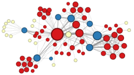

# node2vec group project 

This project is a part of the [Data Mining course](https://www.uu.se/en/admissions/master/selma/kursplan/?kKod=1DL370&lasar=) at Uppsala University, Sweden. 
Team members are [Dmitrijs Kass](https://github.com/dmitrijsk), 
[Hardy Hasan](https://github.com/HardyHasan94) 
and [Yasser Kaddoura](https://github.com/YasserKa).

The goal of the project is two-fold: 
* reproduce the experimental results in **node2vec: Scalable Feature Learning for Networks** [1],
* perform additional experiments with network graphs not used in the above-mentioned paper. 

[1] Grover, A., & Leskovec, J. (2016, August). node2vec: Scalable feature learning for networks. In *Proceedings of the 22nd ACM SIGKDD international conference on Knowledge discovery and data mining* (pp. 855-864). [https://doi.org/10.1145/2939672.2939754](https://doi.org/10.1145/2939672.2939754) 

## What is node2vec?

node2vec is an algorithmic framework for representational learning on graphs. 
Given any graph, it can learn continuous feature representations for the nodes, 
which can then be used for various downstream machine learning tasks [2]. 

The following are three examples of downstream machine learning tasks that we implemented in this repo: 

| Task | Student | 
| -------- | -------- | 
| Clustering ([see below](#clustering))            | [Dmitrijs Kass](https://github.com/dmitrijsk)   |
| Classification ([see below](#classification))    | [Yasser Kaddoura](https://github.com/YasserKa)  |
| Link prediction ([see below](#link-prediction))  | [Hardy Hasan](https://github.com/HardyHasan94)  |

No manual feature engineering is required. The following figure from [3] summarizes the goal of the graph representation learning:


[2] node2vec project page: [https://snap.stanford.edu/node2vec](https://snap.stanford.edu/node2vec). \
[3] Stanford CS224W: Machine Learning with Graphs. Lecture "Node embeddings" slides. Available [here](http://web.stanford.edu/class/cs224w/slides/03-nodeemb.pdf).

## Dependencies

This repo is a fork from [the official reference implementation](https://github.com/aditya-grover/node2vec) of [1].
Clone the current repo, create the `conda` virtual environment and install the requirements:

```
git clone https://github.com/dmitrijsk/node2vec.git
conda create -n node2vec-env python=3.8
conda activate node2vec-env
python -m pip install -r node2vec/requirements.txt
```

## Clustering

### Introduction

We are sometimes interested in identifying homogenuous group of nodes in a network. 
However, homegeneity can be defined in various ways. 
According to [1], node2vec can compute embeddings of nodes with emphasis on either **homophily** or **structural equivalence**. 
This is illustrated in a figure below from [1]:


Under the **homophily** hypothesis nodes that are highly interconnected and belong to similar network clusters or communities should be embedded closely together.
E.g., nodes *s1* and *u* in Figure 1 belong to the same network community

Under the **structural equivalence** assumption nodes that have similar structural roles in networks should be embedded closely together.
E.g., nodes *u* and *s6* in Figure 1 act as hubs of their corresponding communities.

Unfortunately, clustering under the **structural equivalence** assumption could not be reproduced in this and a few other works. Mode details below.


### Reproduction of Figure 3 in [1]

Below is a reproduction of **homogeneity** clustering of characters in the novel Les Misérabthe, which is at the top of Figure 3 in [1]. 
The reproduced figure uses node2vec for node embeddings with the return parameter *p=1* and in-out parameter *q=0.5* 
and *k*-means for clustering with *k=6* clusters.

| Homogeneity: Top of Figure 3 in [1] | Our reproduction with node2vec | 
| -------- | -------- | 
|  |   |

It is not exactly 1-to-1, but is sufficiently close.

Unfortunately, clustering under the **structural equivalence** hypothesis could not be reproduced with *p=1*, *q=2* and 3 clusters. 
It turns out that this is a known issue: 

* According to [4], even with grid-search over hyper-parameters, no result could capture the structural equivalence. 
The graph kept representing the community structure.
* According to [5], node2vec should not even be capable of capturing the notion of structural equivalence. 
The reason is that two nodes that are "far" in the network will tend to be separated in the latent representation, 
independent of their local structure. 

The summary below shows from left to right: the original figure from [1] reflecting structural equivalence, 
our reproduction with node2vec embeddings with the recommended hyper-parameters, 
our reproduction with struc2vec embeddings (official implementation available [here](https://github.com/leoribeiro/struc2vec)).   


| Structual equivalence: Bottom of Figure 3 in [1] | Our reproduction with node2vec | Our reproduction with struc2vec | 
| -------- | -------- | -------- |  
|  |   |  |

node2vec embeddings (middle) clearly fail to capture the structural equivalence. 
struc2vec embeddings do not fully reproduce the original figure, but it does reflect the structural equivalence.
Yellow nodes mostrly represent characters that are at the periphery and have limited interaction. 
And blue-colored nodes represent characters that act as bridges between different sub-plots of the novel.

[4] Schliski, F., Schlötterer, J., & Granitzer, M. (2020). Influence of Random Walk Parametrization on Graph Embeddings. Advances in Information Retrieval, 12036, 58. \
[5] Ribeiro, L. F., Saverese, P. H., & Figueiredo, D. R. (2017, August). struc2vec: Learning node representations from structural identity. In Proceedings of the 23rd ACM SIGKDD international conference on knowledge discovery and data mining (pp. 385-394).


### Python implementation

Code is available in `src/kmeans.py`. To run the code from the command line use:

`python src/kmeans.py`

The initial purpose was to reproduce Figure 3 in node2vec paper. Therefore, the default type of analysis is homophily clustering of Les Misérables characters. To use the code for other purposes, please read below about changing parameter values.

Three types of analyses are supported: 

1. Homophily (community structure) with node2vec embeddings.
2. Structural equivalance with node2vec embeddings.
3. Structural equivalance with struc2vec embeddings. struc2vec embeddings for Les Misérables and [TerroristRel](https://networkrepository.com/TerroristRel.php) data sets are already available. To obtain embeddings for other data sets in Python 3 consider using, for example, [BioNEV](https://github.com/xiangyue9607/BioNEV).

Change the value of the `SWITCH` variable to define the type of analysis. Available options are `homophily`, `str_eq`, `struc2vec`.

Two types of graph data sets are supported:

1. An arbitrary data set in an external edgelist text file.
2. Les Misérables from `nx.generators.social.les_miserables_graph()` because it contains the names of characters in the novel instead of integer identifiers.

Change the value of the `DATA_NAME` variable to define a data set to be used. The value should be the same as in the folder name and the edgelist file name. For example, use `TerroristRel` to import from `graph/TerroristRel/TerroristRel.edges`.

Additional parameters are set in the `args` variable:

* node2vec's parameters `D` (dimensionality of embeddings), `P` (return parameter), `K` (context size) and `L` (walk length).
* `edgelist_delim`, default is comma.

A few other parameters depend on the type of analysis and are set automatically. For example, homophily by default sets the in-out parameter `Q` to 0.5 and the number of clusters `n_clusters` to 6. This can be changed in the `set_other_parameters()` function if needed.

The code outputs images into the `images/` folder.


## Classification
Code is available in `src/classification.ipynb` (Jupyter Notebook)
Sections of the notebook: 
- Replicate the classification experiment in section **4.3 Multi-label classification** 
- Grid search on `p` and `q`
- Scalability test (not used in presentataion)
## Link Prediction
- The files src/dataProcessing.py, src/main.py and src/linkPrediction.py are used for link prediction.
- Given an original edgelist, link prediction is performed as follows, where the data used is karate.edgelist:
1. To obtain training graph and testing edges, execute the following command from the project home directory:
```python3 src/dataProcessing.py --input_path graph/karate/karate.edgelist --output_train_path graph/karate/train_edges --output_test_path graph/karate/test_edges --testing_data_ratio 0.2```
2. To obtain node embeddings, execute the following command from the project home directory: 
```python3 src/main.py --input graph/karate/train_edges --output emb/karate.emb     ```
3.  To obtain predictions, execute the following command from the project home directory
```python3 src/linkPrediction.py --original_edges_path graph/karate/karate.edgelist --node_embeddings_path emb/karate.emb --training_edges_path graph/karate/train_edges --test_edges_path graph/karate/test_edges```
